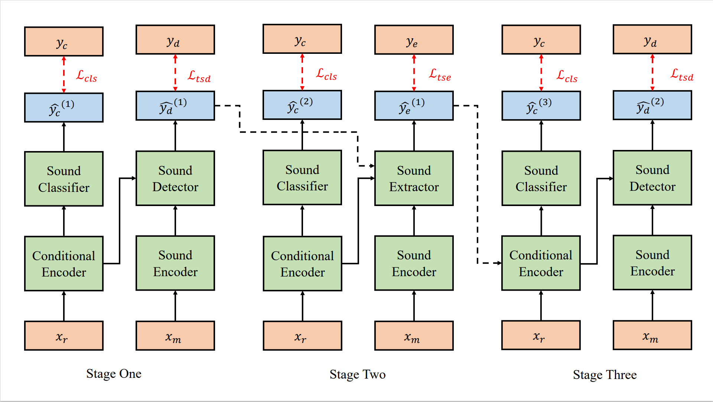
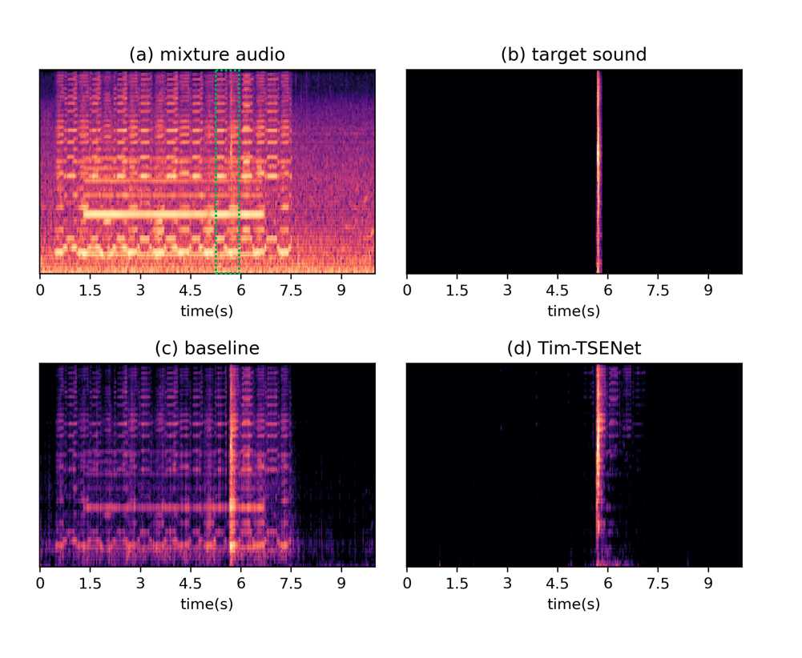
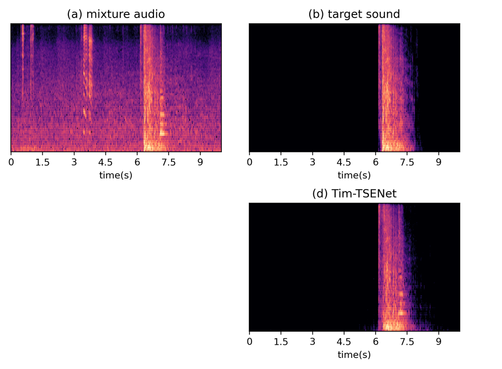
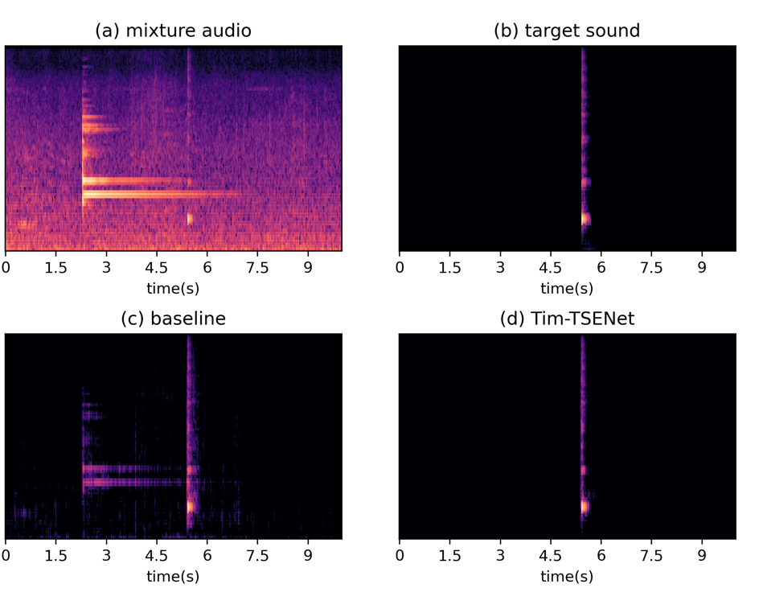
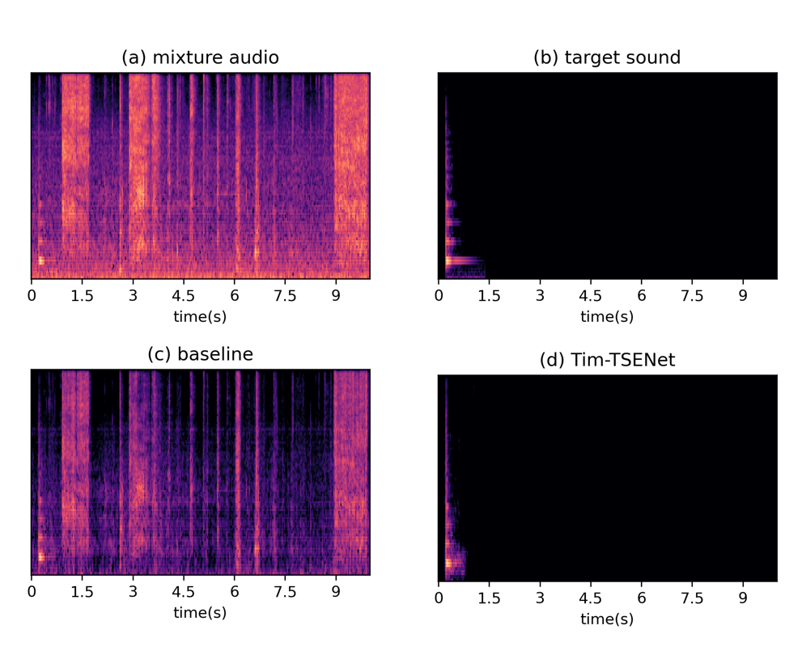
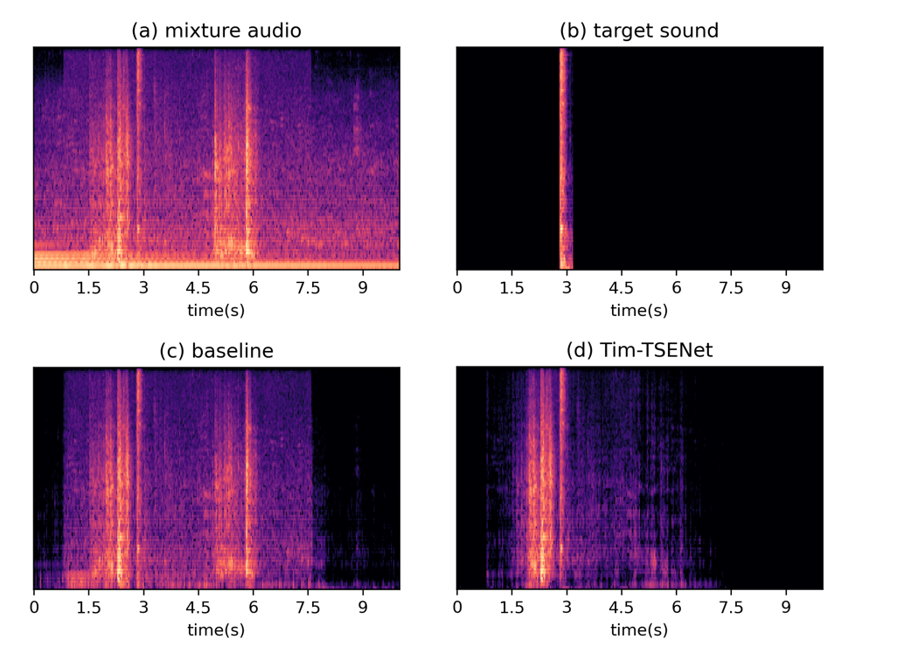

## Improving Target Sound Extraction with Timestamp Information

### Introduction

This is a [demo](http://dongchaoyang.top/Tim-TSENet-demo/) for our paper **_Improving Target Sound Extraction with Timestamp Information_**. In the following, we will show some examples extracted by our methods.  

  

  
Block Diagram of the Proposed Tim-TSENet

	

### Demo 1: The comparison between baseline and Tim-TSENet
* **Sample 1**
    * **Mixture**
    <audio src="exp1/val_1001.wav" controls="controls">ERROR</audio>
    * **Target sound**
    <audio src="exp1/val_1001_lab.wav" controls="controls">ERROR</audio>
    * **Baseline**
    <audio src="exp1/val_1001_base.wav" controls="controls">ERROR</audio>
    * **Ours: Tim-TSENet**
    <audio src="exp1/val_1001_tsd.wav" controls="controls">ERROR</audio>

  

---

* **Sample 2:**
    * **Mixture**
    <audio src="exp2/val_1004.wav" controls="controls">ERROR</audio>
    * **Target sound**
    <audio src="exp1/val_1004_lab.wav" controls="controls">ERROR</audio>
    * **Baseline**
    <audio src="exp1/val_1004_base.wav" controls="controls">ERROR</audio>
    * **Ours: Tim-TSENet**
    <audio src="exp1/val_1004_tsd.wav" controls="controls">ERROR</audio>

  

---

* **Sample 3**
   * **Mixture**
    <audio src="exp3/val_1005.wav" controls="controls">ERROR</audio>
    * **Target sound**
    <audio src="exp3/val_1005_lab.wav" controls="controls">ERROR</audio>
    * **Baseline**
    <audio src="exp3/val_1005_base.wav" controls="controls">ERROR</audio>
    * **Ours: Tim-TSENet**
    <audio src="exp3/val_1005_tsd.wav" controls="controls">ERROR</audio>

  

---

* **Sample 4:**
    * **Mixture**
    <audio src="exp4/val_1007.wav" controls="controls">ERROR</audio>
    * **Target sound**
    <audio src="exp4/val_1007_lab.wav" controls="controls">ERROR</audio>
    * **Baseline**
    <audio src="exp4/val_1007_base.wav" controls="controls">ERROR</audio>
    * **Ours: Tim-TSENet**
    <audio src="exp4/val_1007_tsd.wav" controls="controls">ERROR</audio>

  

### Limitations
We also find some samples still includes other sound events, especially when the interfere with the sound is similar with the target sound. It will be part of our future work.
* **Sample 1**
    * **Mixture**
    <audio src="exp5_l/val_1009.wav" controls="controls">ERROR</audio>
    * **Target sound**
    <audio src="exp5_l/val_1009_lab.wav" controls="controls">ERROR</audio>
    * **Baseline**
    <audio src="exp5_l/val_1009_base.wav" controls="controls">ERROR</audio>
    * **Ours: Tim-TSENet**
    <audio src="exp5_l/val_1009_tsd.wav" controls="controls">ERROR</audio>

  

### Links

[Paper] [Bibtex] [[ADSPLab@PKU](https://web.pkusz.edu.cn/adsp/)] [TencentAILab]

### References

[1] Delcroix M, Vázquez J B, Ochiai T, et al. Few-shot learning of new sound classes for target sound extraction[J]. arXiv preprint arXiv:2106.07144, 2021.
[2] Ochiai T, Delcroix M, Koizumi Y, et al. Listen to what you want: Neural network-based universal sound selector[J]. arXiv preprint arXiv:2006.05712, 2020.
[3] Luo Y, Mesgarani N. Conv-tasnet: Surpassing ideal time–frequency magnitude masking for speech separation[J]. IEEE/ACM transactions on audio, speech, and language processing, 2019, 27(8): 1256-1266.